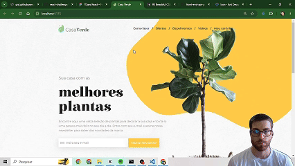
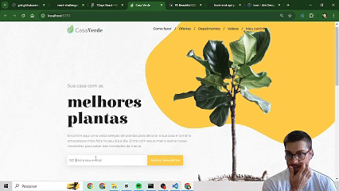

## Welcome to a Front-End Challenge 👋

# Casa das Plantas

## Test the project yourself: [Test the project here!!!](https://react-challenge-red.vercel.app/)
## [Figma Project - model](https://www.figma.com/design/0yOQR6fGtbdrmqeStiO0jf/7Days-React?node-id=0-1&p=f)

### Full Page



## Add your email



## Some code that I'm proud of
```js
const sendEmail = (e) => {
    e.preventDefault()

    if(invalidEmail !== "" || emptyEmail !== "" ) {
        return;
    } else {
        setAllRight("Email de contato enviado!")
    }
    alert("Email enviado com sucesso!")

    emailjs.sendForm('######', '########', e.target, '############')
    .then((response) => {
        console.log('Email enviado', response.status, response.text)
        setEmail('')
        setInvalidEmail('')
        setAllRight('')
        window.scrollTo({ top: 0, left: 0, behavior: 'smooth' });
    }, (err) => {
        console.log("ERRO: ", err)
    })
}
```

## Built with

- `React Vite`
- [`Ant Design`](https://www.npmjs.com/package/antd)
- [`Axios`](https://www.npmjs.com/package/axios)

## You Can
- See the products;
- Consume an API - product list;
- Check if the email is valid;
- Receive an automatic email.

## Author

- Website - [My GitHub](https://github.com/lucasbailo)
- Frontend Mentor - [@lucasbailo](https://www.frontendmentor.io/profile/lucasbailo)
- Instagram - [@lucassbailo](https://www.instagram.com/lucassbailo/)
- LinkedIn - [Lucas Bailo](https://www.linkedin.com/in/lcsbailo)
